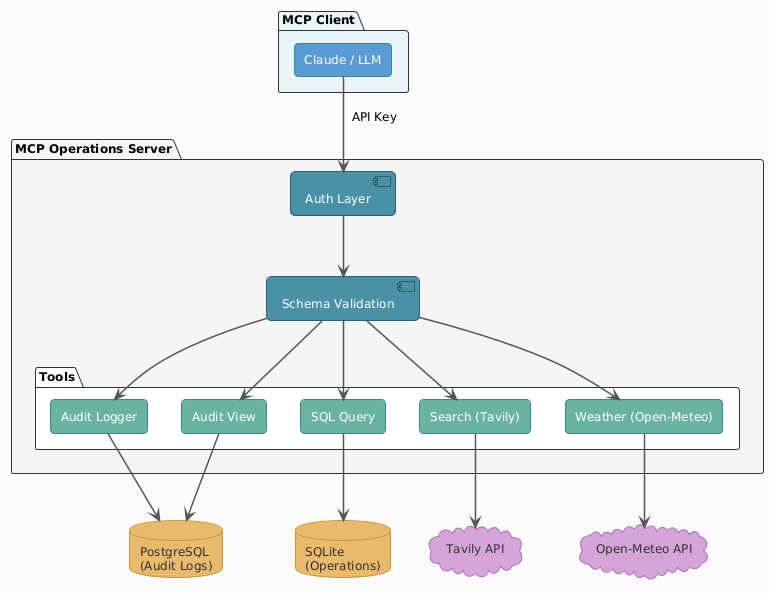

# MCP Operations Infrastructure

A production-ready Model Context Protocol (MCP) server demonstrating secure, schema-driven LLM interactions with external APIs and databases.

## Features

### Security & Authentication
- **Token-based authentication** with API keys
- **Role-based access control** (Admin, Analyst, Readonly)
- **Constrained tool usage** - each role has specific permissions

### Schema-Driven Interactions
- **Pydantic validation** for all inputs and outputs
- **SQL injection prevention** via query validation
- **Structured error handling** with consistent error codes

### Audit Trail
- **PostgreSQL-backed audit logging** for all tool executions
- **Queryable audit history** with filtering by user, tool, time
- **Sensitive data redaction** in logs

### Available Tools

| Tool | Description | Roles |
|------|-------------|-------|
| `sql_query` | Execute SELECT queries on operations database | All |
| `database_schema` | Get schema information | All |
| `web_search` | Search the web via Tavily API | Admin, Analyst |
| `weather` | Get weather forecasts | All |
| `geocode_location` | Look up coordinates for cities | All |
| `view_audit_log` | Query audit history | Admin, Analyst |

## Quick Start

### Prerequisites
- Docker & Docker Compose
- Python 3.11+ (for local development)
- Tavily API key (optional, for web search)

### 1. Clone and Configure

```bash
git clone <your-repo-url>
cd mcp-ops-infrastructure

# Copy environment template
cp .env.example .env

# Edit .env with your configuration
# At minimum, add your TAVILY_API_KEY for web search
```

### 2. Generate API Keys

```bash
# Generate secure API keys
python -c "import secrets; print('Admin key:', secrets.token_urlsafe(32))"
python -c "import secrets; print('Analyst key:', secrets.token_urlsafe(32))"

# Add to .env:
# API_KEYS=<admin-key>:admin,<analyst-key>:analyst
```

### 3. Run with Docker

```bash
# Start all services
docker-compose up -d

# View logs
docker-compose logs -f mcp-server

# Stop services
docker-compose down
```

### 4. Local Development

```bash
# Create virtual environment
python -m venv venv
source venv/bin/activate  # or `venv\Scripts\activate` on Windows

# Install dependencies
pip install -r requirements.txt

# Start PostgreSQL (for audit logging)
docker-compose up -d postgres

# Run server
python -m src.server
```

## Architecture



## Sample Database Schema

The operations database includes sample data for demonstration:

**customers**
```sql
id, name, email, company, industry, created_at, lifetime_value, is_active
```

**products**
```sql
id, name, category, price, stock_quantity, is_available
```

**orders**
```sql
id, customer_id, order_date, total_amount, status, shipping_city, shipping_country
```

**metrics**
```sql
id, date, metric_name, value, dimension
```

## Usage Examples

### Query Database
```python
# Via MCP client
await client.call_tool("sql_query", {
    "query": "SELECT company, SUM(lifetime_value) as total FROM customers GROUP BY company ORDER BY total DESC LIMIT 5"
})
```

### Web Search
```python
await client.call_tool("web_search", {
    "query": "latest AI developments",
    "max_results": 5
})
```

### Weather Lookup
```python
# First geocode the location
location = await client.call_tool("geocode_location", {"location": "Boston"})

# Then get weather
weather = await client.call_tool("weather", {
    "latitude": location["results"][0]["latitude"],
    "longitude": location["results"][0]["longitude"],
    "days": 3
})
```

## Configuration Reference

| Variable | Description | Default |
|----------|-------------|---------|
| `AUTH_ENABLED` | Enable authentication | `true` |
| `API_KEYS` | Comma-separated key:role pairs | - |
| `TAVILY_API_KEY` | Tavily search API key | - |
| `POSTGRES_*` | PostgreSQL connection settings | See .env.example |
| `AUDIT_ENABLED` | Enable audit logging | `true` |

## Testing

```bash
# Run tests
pytest tests/ -v

# With coverage
pytest tests/ --cov=src --cov-report=html
```

## Claude Desktop Integration

### macOS

Config location: `~/Library/Application Support/Claude/claude_desktop_config.json`

```json
{
  "mcpServers": {
    "ops-server": {
      "command": "docker",
      "args": ["compose", "-f", "/path/to/mcp-ops-infrastructure/docker-compose.yml", "run", "--rm", "mcp-server"],
      "env": {
        "TAVILY_API_KEY": "your-key"
      }
    }
  }
}
```

### Windows

Config location: `%APPDATA%\Claude\claude_desktop_config.json`

```json
{
  "mcpServers": {
    "ops-server": {
      "command": "docker",
      "args": ["compose", "-f", "C:\\path\\to\\mcp-ops-infrastructure\\docker-compose.yml", "run", "--rm", "mcp-server"],
      "env": {
        "TAVILY_API_KEY": "your-key"
      }
    }
  }
}
```

> **Note**: On Windows, use double backslashes (`\\`) in file paths within JSON, or forward slashes (`/`) which Docker also accepts.

## Project Structure

```
mcp-ops-infrastructure/
├── docker-compose.yml    # Multi-container setup
├── Dockerfile            # Server container
├── requirements.txt      # Python dependencies
├── .env.example          # Configuration template
├── src/
│   ├── server.py         # Main MCP server
│   ├── config.py         # Settings management
│   ├── auth/
│   │   └── authenticator.py  # Auth & RBAC
│   ├── audit/
│   │   └── logger.py     # Audit trail
│   ├── database/
│   │   └── connection.py # SQLite operations DB
│   ├── schemas/
│   │   └── models.py     # Pydantic schemas
│   └── tools/
│       ├── sql_tool.py   # SQL query tool
│       ├── search_tool.py    # Tavily search
│       └── weather_tool.py   # Weather + geocoding
└── tests/
    └── test_tools.py
```
